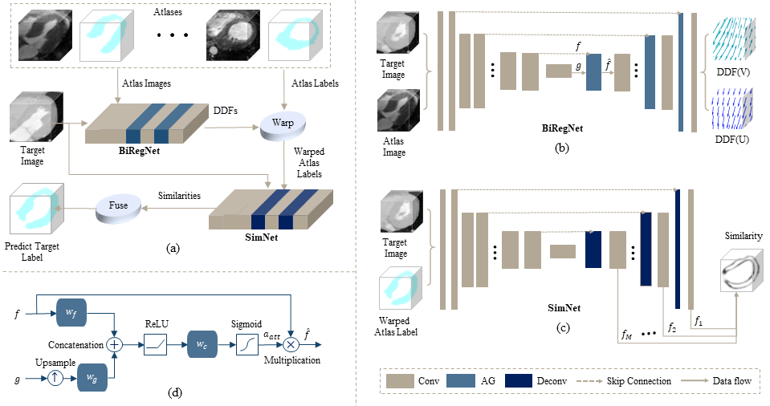
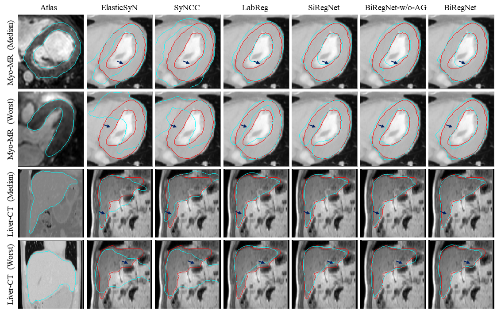
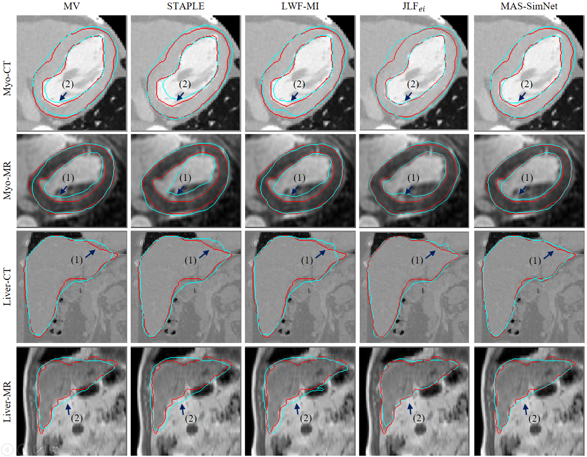
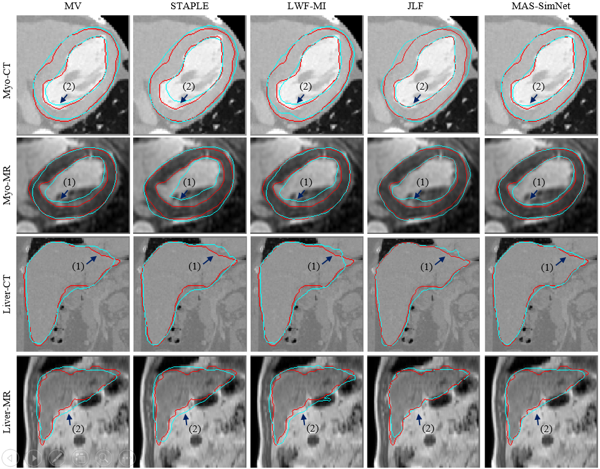

# Abstract 
Multi-atlas segmentation (MAS) is a promising framework for medical image segmentation. Generally, MAS methods register multiple atlases, i.e.,  medical images with corresponding labels, to a target image; and the transformed atlas labels can be combined to generate target segmentation via label fusion schemes. Many conventional MAS methods employed the atlases from the same modality as the target image.	However, the number of atlases with the same modality may be limited or even missing in many clinical applications. Besides, conventional MAS methods surfer from the computational burden of registration or label fusion procedures. In this work, we design a novel cross-modality MAS framework, which uses available atlases from a certain modality to segment a target image from another modality. To boost the computational efficiency of the framework, both the image registration and label fusion are achieved by well-designed deep neural networks. For the atlas-to-target image registration, we propose a bi-directional registration network (BiRegNet), which can efficiently align images from different modalities. For the label fusion, we design a similarity estimation network (SimNet), which estimates the fusion weight of each atlas by measuring its similarity to the target image. SimNet can learn multi-scale information for similarity estimation to improve the performance of label fusion. The proposed framework was evaluated by the left ventricle and liver segmentation tasks on the MM-WHS and CHAOS datasets, respectively. Results have shown that the framework is effective for cross-modality MAS in both registration and label fusion. The [code](https://github.com/NanYoMy/cmmas) will be released publicly once the manuscript is accepted.

# Conference Version of the Cross-Modality MAS
The cross-modality MAS method was first published on MICCAI2020, and the source codes are provided at [miccai2020-cross-modality-mas](./miccai2020-cross-modality-mas). This project contains source codes for our journal version paper.

`Ding, Wangbin, et al. "Cross-modality multi-atlas segmentation using deep neural networks." International Conference on Medical Image Computing and Computer-Assisted Intervention. Springer, Cham, 2020.`

# Cross-Modality Multi-Atlas Segmentation via Deep Registration and Label Fusion
This repository contains the code for the paper "Cross-Modality Multi-Atlas Segmentationvia Deep Registration and Label Fusion", which proposes multi-atlas segmentation framework based on deep neural network from cross-modality medical images. The project is still under constructing. At present, we have released the core codes.   

This framework has been applied to liver and heart segmentation task:
[CHAOS](https://chaos.grand-challenge.org/) & [MMWHS](http://www.sdspeople.fudan.edu.cn/zhuangxiahai/0/mmwhs17/index.html).

This is the diagram of the proposed cross-modality MAS framework:
<!--  --> 

This is an example of the output of the registration network:
<!--  -->

This is an example of the output of the label fusion:
<!-- -->

## Overview
This repository contains two main code:
- [cross_modality_registration_network](./proj/learn2attreg.py): Performs the registration of cross-modality medical images.
- [labelfusion_network](./proj/labelintensityfusionnet.py): Calculates the weight of  registered atlases  for label fusion.

## Acknowledgement
This project is largely based on the "labreg", "simpleitk", "antspy" repositories.
## Reference 

## Contact
If have any question, create a new issue, or directly email me at moon_well@live.cn
